<h3>Activité Pratique N°3 : Systèmes Distribués avec GRPC</h3>
<h1>compte rendu</h1>
<h1>Beidja Cheikh </h1>

<h1>=> Première Partie : </h1>
- Unary Model 
- Server Sreaming Model  
- Client Streaming Model  
- BiDirectional Streaming Model  

<h2>Package grpc-enset</h2>

Maven dependencies  pom.xml:   
Class BankGrpcClient1 : 
<h4>=> démonstration  </h4>
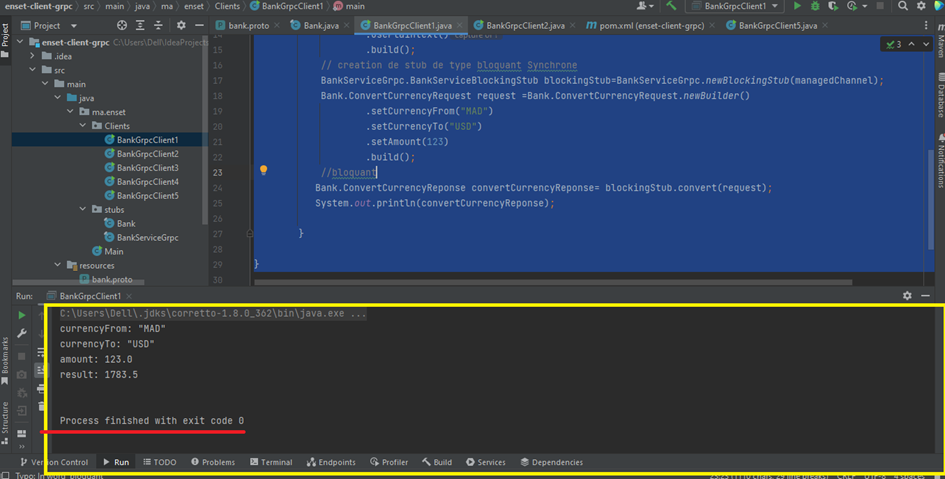   
Class BankGrpcClient2 : 
<h4>=> démonstration  </h4>
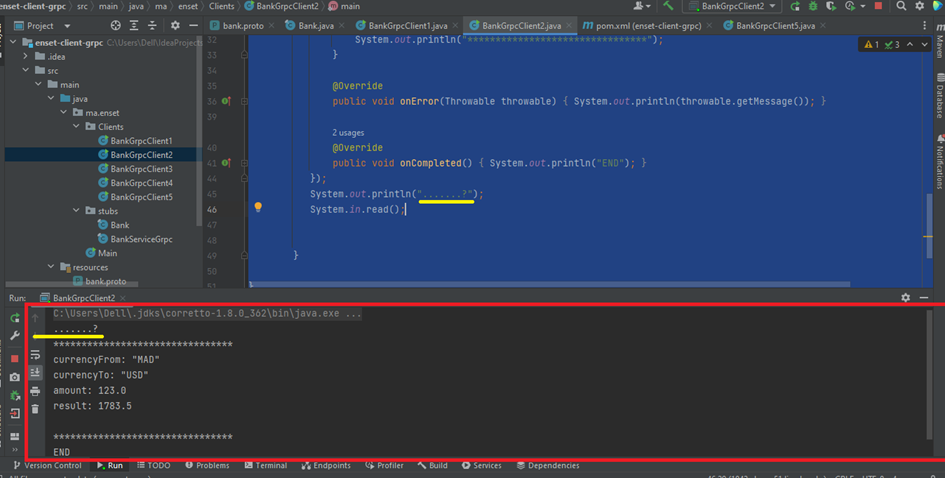   
Class BankGrpcClient3 : 
<h4>=> démonstration  </h4>
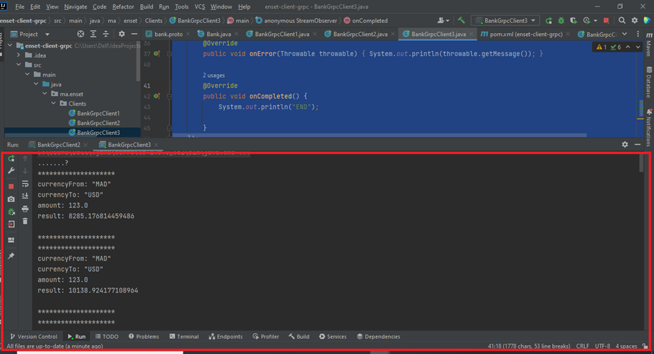   
Class BankGrpcClient4 :
<h4>=> démonstration  </h4>
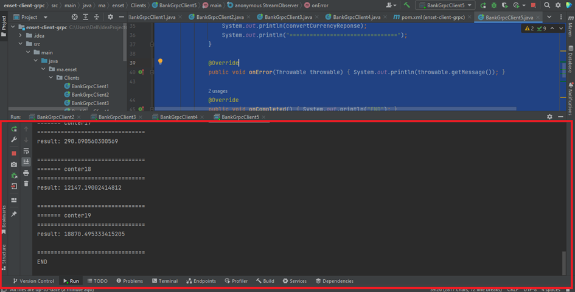   
<h1>=> Deuxième partie</h1>
 <h2>1. Créer un serveur Chat GRPC</h2>
  <h3>Package chat_GRPC</h3>
   <h4>La file Bank.proto :</h4>
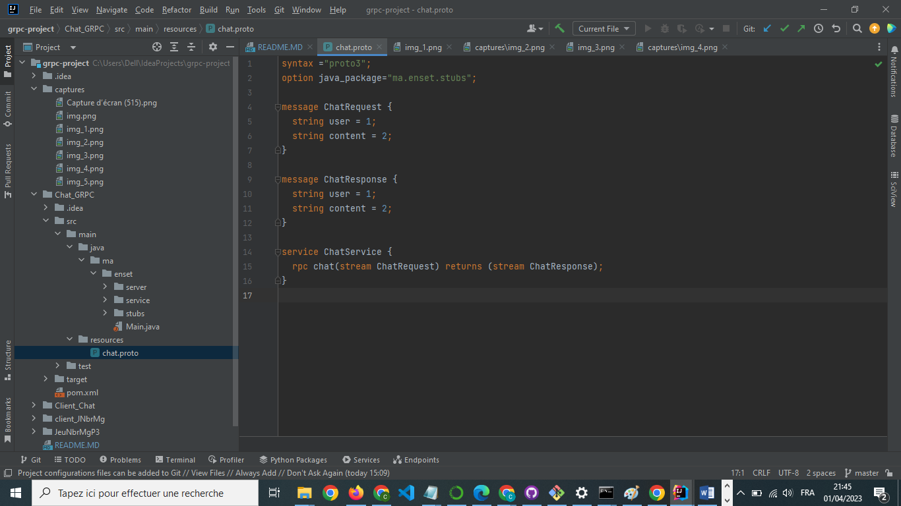   
 <h3>Class GrpcServce :</h3>
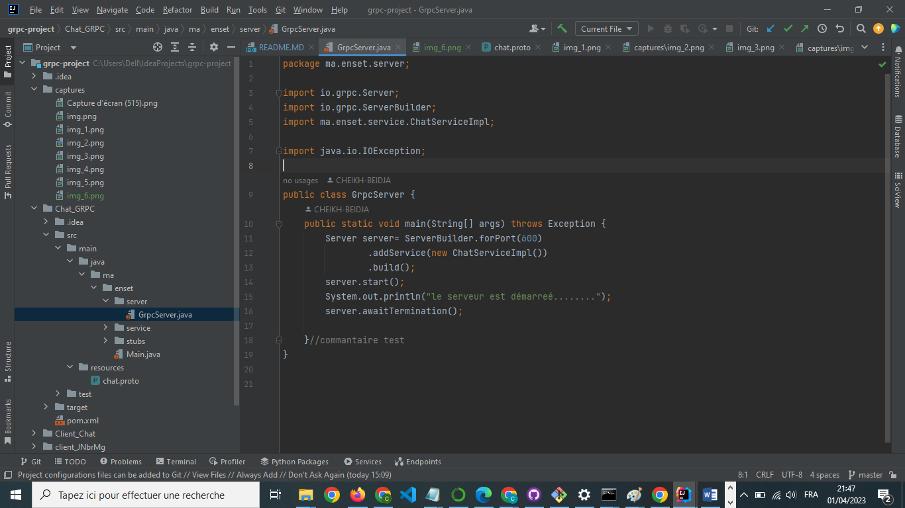   
<h2>2. Tester le serveur Chat avec un client GRPC comme BloomRPC</h2>
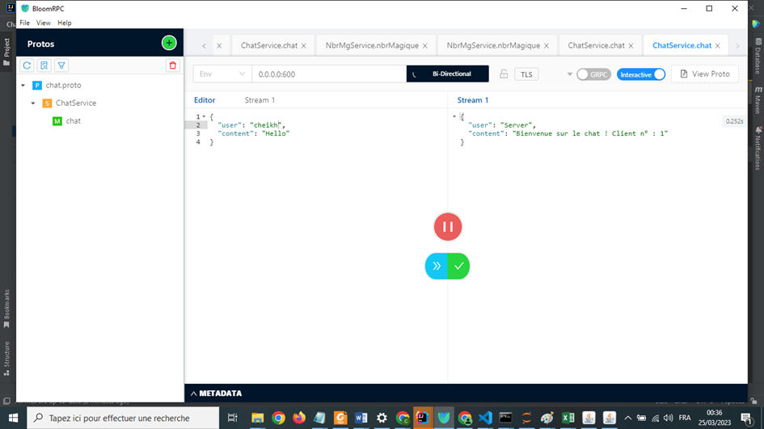   
<h2>3. Créer un client GRPC Java</h2>
<h3>Package Client_Chat : </h3>
 <h3> Class ClientChat :</h3>
<h3>=> démonstration </h3>
 <h3>Demurrage du server:</h3>
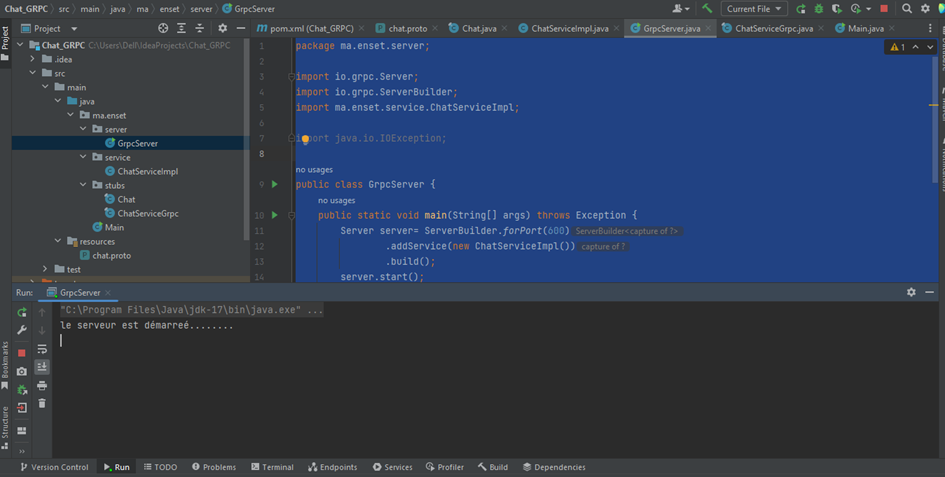   
<h3>Test du client java</h3>
 
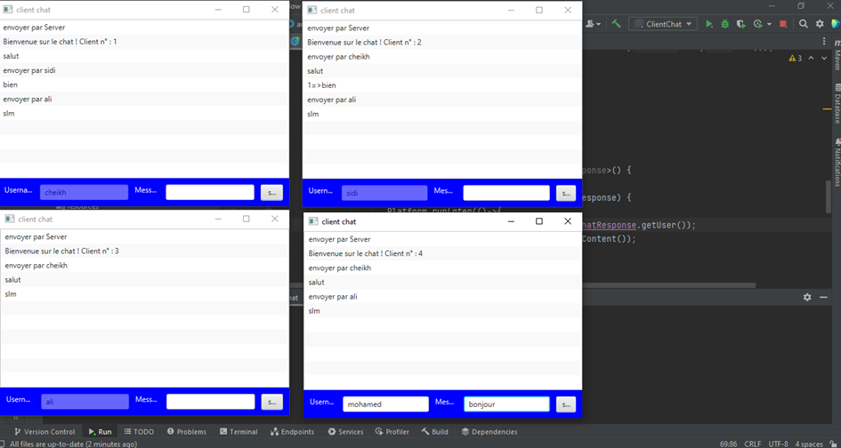 
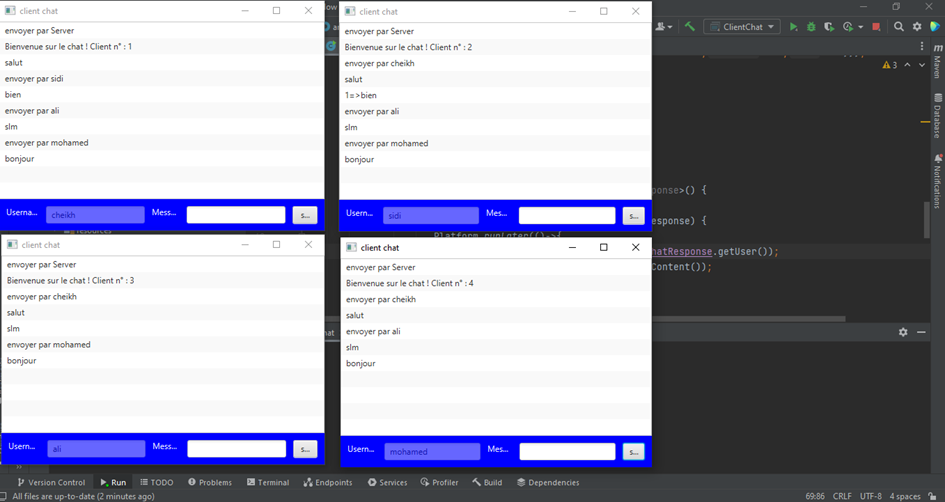   
<h1>=> Troisième partie</h1>
<h2>1. Créer un serveur JEU GRPC :</h2>
 <h3>Package JeuNbrMgP3</h3>
<h3>La file Bank.proto :</h3>
   
<h3>Class GrpcServer : </h3>
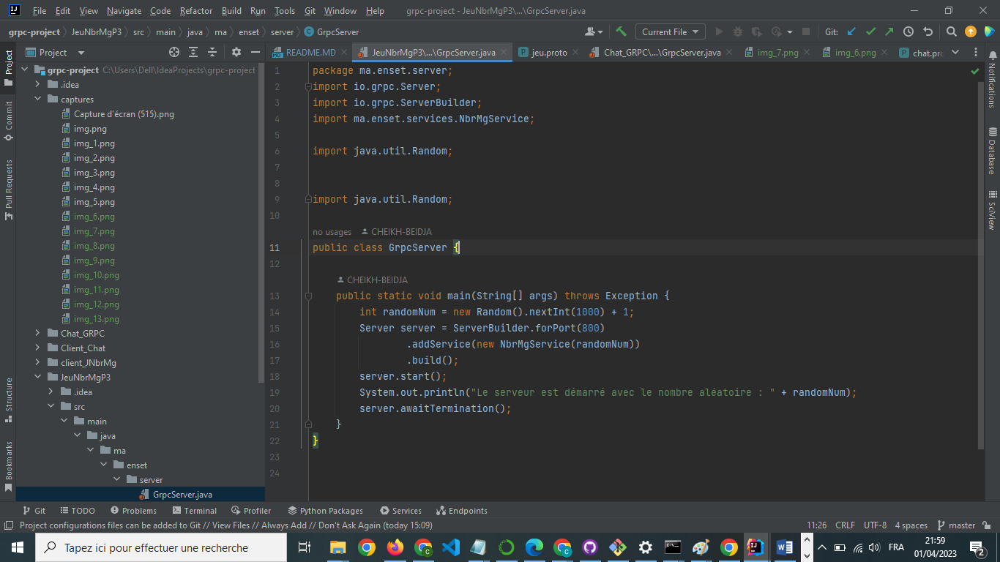   
<h2>2. Créer un client GRPC Java</h2>
<h3>Package client_JNbrMg :</h3>
 <h3>Demurrage du server:</h3>
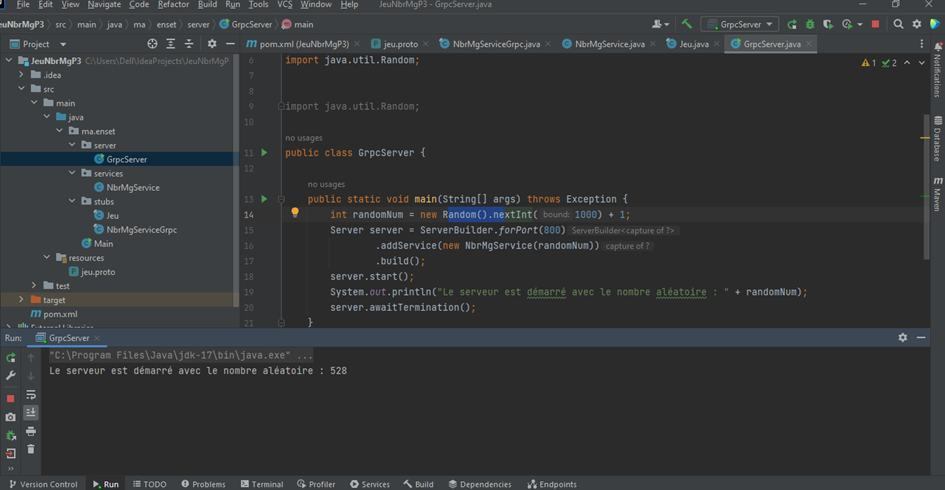   
<h3>Test du client java</h3>
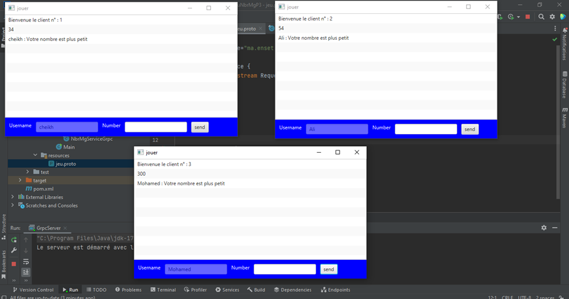
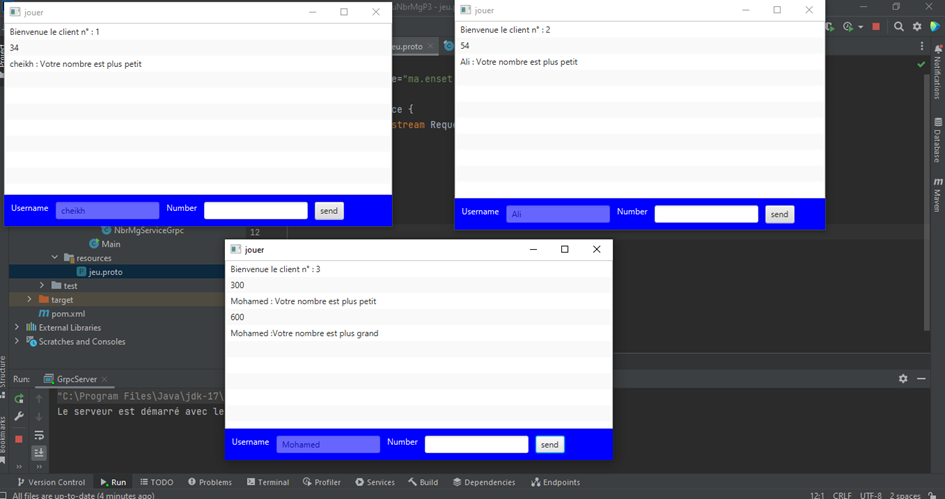
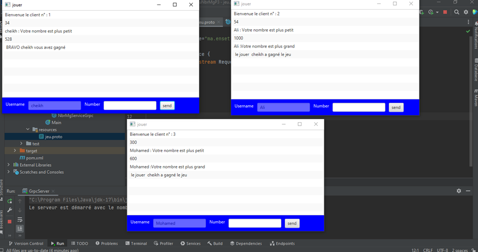

